## src/mocks/class.cpp:

### Inheritance:

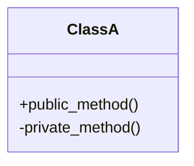
### Methods:

#### ClassA:

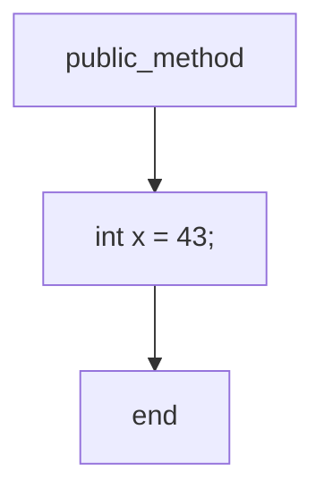
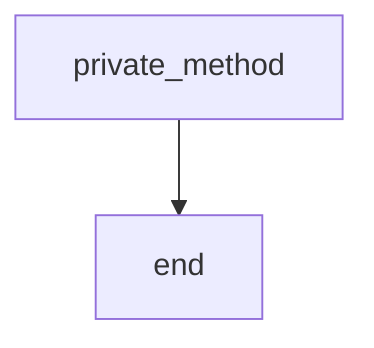
## src/mocks/class_struct_union.cpp:

### Inheritance:


### Methods:

#### ClassShouldBeIncluded:

## src/mocks/hello_world.cpp:

### Inheritance:

```mermaid
classDiagram
x
```
### Methods:

## src/mocks/incomplete_class.cpp:

### Inheritance:


### Methods:

#### IncompleteClassIncludedOnce:

## src/mocks/inheritance.cpp:

### Inheritance:

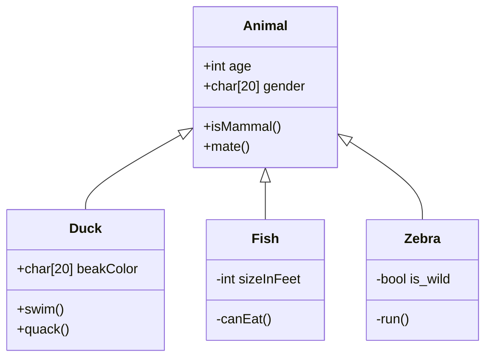
### Methods:

#### Animal:

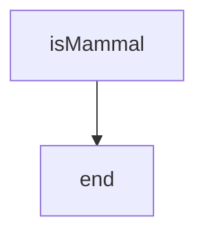
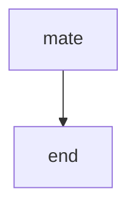
#### Duck:

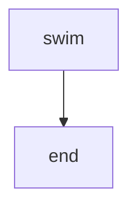
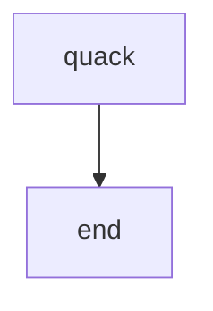
#### Fish:

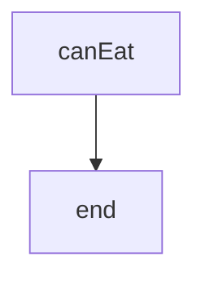
#### Zebra:

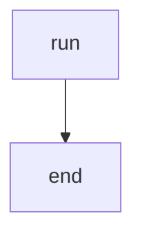
## src/mocks/inner_class.cpp:

### Inheritance:

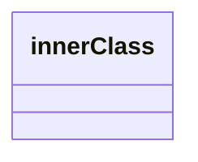
### Methods:

#### innerClass:

## src/mocks/rich_method.cpp:

### Inheritance:

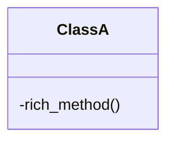
### Methods:

#### ClassA:

```mermaid
flowchart TB
0x7fbb3000cd00["rich_method"]
0x7fbb3000cd00 --> 0x7fbb3000ce90
0x7fbb3000ce90["int a = 2;"]
0x7fbb3000cf48["int b = 3;"]
0x7fbb3000ce90 --> 0x7fbb3000cf48
0x7fbb3000d090["b = b * 5 - 6 * a"]
0x7fbb3000cf48 --> 0x7fbb3000d090
0x7fbb3000d1c0["int c = a + b;"]
0x7fbb3000d090 --> 0x7fbb3000d1c0
0x7fbb3000d2c8["bool d = c > 4;"]
0x7fbb3000d1c0 --> 0x7fbb3000d2c8
0x7fbb3000d3a8_con(( ))
0x7fbb3000d3a8_brk(( ))
0x7fbb3000d3a8{"a > 0"}
0x7fbb3000d3a8_con --> 0x7fbb3000d3a8
0x7fbb3000d3a8 -->|"No"| 0x7fbb3000d3a8_brk
0x7fbb3000d3a8 -->|"Yes"| 0x7fbb3000d378
0x7fbb3000d378["a--"]
0x7fbb3000d378 --> 0x7fbb3000d3a8_con
0x7fbb3000d2c8 --> 0x7fbb3000d3a8_con
0x7fbb3000d3f8_con(( ))
0x7fbb3000d3f8_brk(( ))
0x7fbb3000d3f8{"true"}
0x7fbb3000d3f8 -->|"Yes"| 0x7fbb3000d3f8_con
0x7fbb3000d3f8 -->|"No"| 0x7fbb3000d3f8_brk
0x7fbb3000d3f8_con --> 0x7fbb3000d3c8
0x7fbb3000d3c8["break"]
0x7fbb3000d3c8 --> 0x7fbb3000d3f8_brk
0x7fbb3000d3a8_brk --> 0x7fbb3000d3f8_con
0x7fbb3000d5d0_con(( ))
0x7fbb3000d5d0_brk(( ))
0x7fbb3000d5d0{{"int i = 1; i < 8; ++i"}}
0x7fbb3000d5d0_con --> 0x7fbb3000d5d0
0x7fbb3000d5d0 --> 0x7fbb3000d5d0_brk
0x7fbb3000d5d0 --> 0x7fbb3000d5a0
0x7fbb3000d5a0["c++"]
0x7fbb3000d5a0 --> 0x7fbb3000d5d0_con
0x7fbb3000d3f8_brk --> 0x7fbb3000d5d0_con
0x7fbb3000d8f0{"a < c"}
0x7fbb3000d8f0_out(( ))
0x7fbb3000d8f0 -->|"Yes"| 0x7fbb3000d6d8
0x7fbb3000d6d8["b += 2"]
0x7fbb3000d6d8 --> 0x7fbb3000d8f0_out
0x7fbb3000d8f0 -->|"No"| 0x7fbb3000d8c0
0x7fbb3000d8c0{"a == c"}
0x7fbb3000d8c0_out(( ))
0x7fbb3000d8c0 -->|"Yes"| 0x7fbb3000d7f0
0x7fbb3000d7f0["b += 1"]
0x7fbb3000d7f0 --> 0x7fbb3000d8c0_out
0x7fbb3000d8c0 -->|"No"| 0x7fbb3000d878
0x7fbb3000d878["b -= 1"]
0x7fbb3000d878 --> 0x7fbb3000d8c0_out
0x7fbb3000d8c0_out --> 0x7fbb3000d8f0_out
0x7fbb3000d5d0_brk --> 0x7fbb3000d8f0
0x7fbb3000d958["return c"]
0x7fbb3000d958 --> 0x7fbb3000cd00_out
0x7fbb3000d8f0_out --> 0x7fbb3000d958
0x7fbb3000cd00_out["end"]
```
