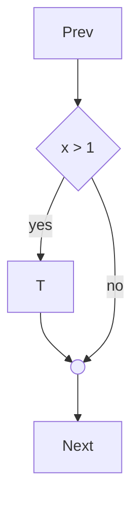
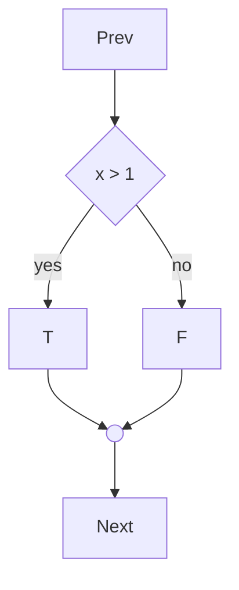
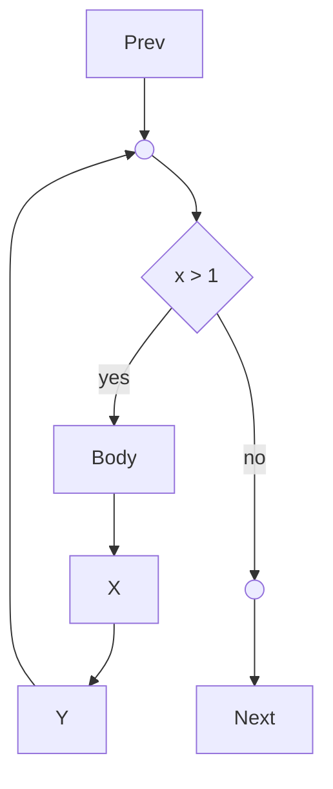
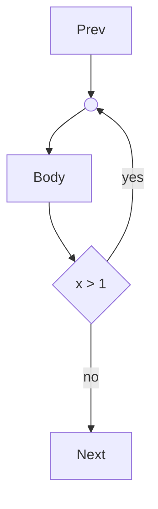
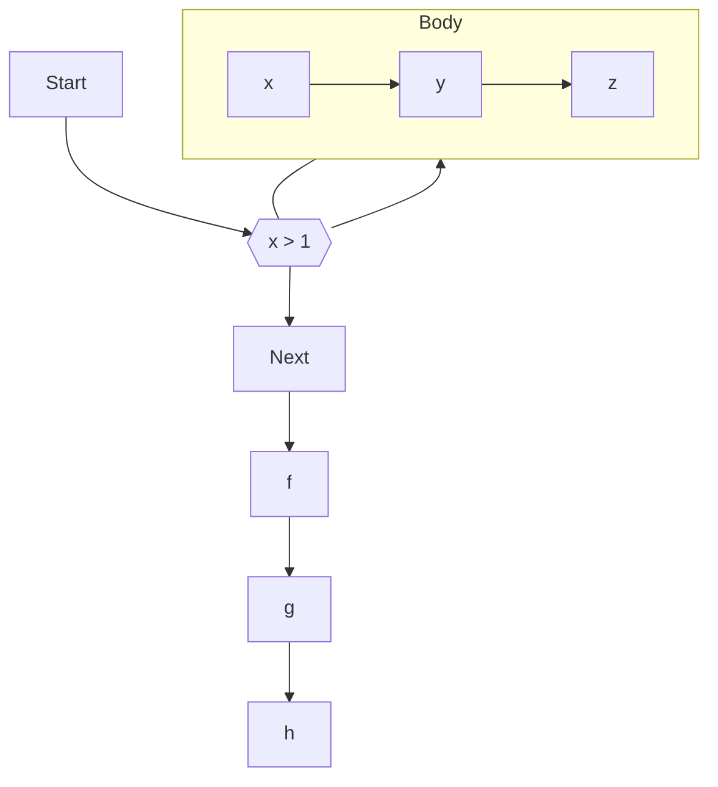

## If Stmt



## If Else Stmt



## While Stmt



## Do Stmt



## For Stmt




```mermaid
flowchart TD

0x7fbb0781fcf0{"a < c"}0x7fbb0781fcf0_out(( ))
0x7fbb0781fcf0 -->|Yes| 0x7fbb0781fad8
0x7fbb0781fad8["b += 2"]
0x7fbb0781fad8 --> 0x7fbb0781fcf0_out
0x7fbb0781fcf0 -->|No| 0x7fbb0781fcc0
0x7fbb0781fcc0{"a == c"}0x7fbb0781fcc0_out(( ))
0x7fbb0781fcc0 -->|Yes| 0x7fbb0781fbf0
0x7fbb0781fbf0["b += 1"]
0x7fbb0781fbf0 --> 0x7fbb0781fcc0_out
0x7fbb0781fcc0 -->|No| 0x7fbb0781fc78
0x7fbb0781fc78["b -= 1"]
0x7fbb0781fc78 --> 0x7fbb0781fcc0_out
0x7fbb0781fcc0_out --> 0x7fbb0781fcf0_out

```